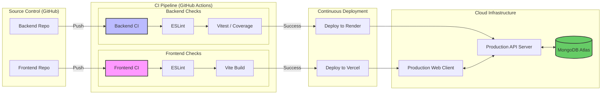

# DevOps Strategy: Real-Time Collaborative Canvas (DesignDeck)

## 1. Project Overview
This DevOps strategy defines the CI/CD lifecycle for the **Team-10-M4** project, which uses a multi-repository architecture. 

*   **Frontend**: React + Vite application.
*   **Backend**: Node.js + Express + MongoDB application.
*   **Real-time Layer**: Yjs (CRDT) for conflict-free shared editing.

---

## 2. Component Identification & Inventory

| Component | Source Code Repository | Deployment Location | Tools & Platforms |
| :--- | :--- | :--- | :--- |
| **Frontend UI** | [PreethiKannan38/Team-10-M4](https://github.com/PreethiKannan38/Team-10-M4)   | **Vercel** | React, Vite, Tailwind CSS, Axios |
| **API Server** | [Harvey-08/SE-Project-Backend](https://github.com/Harvey-08/SE-Project-Backend) | **Render**  | Node.js, Express, Vitest, supertest |
| **Database** | N/A | **MongoDB Atlas** | MongoDB (Cloud Managed) |

---

## 3. DevOps Pipeline Diagram

The following diagram illustrates the flow from code commit to production deployment.

---

## 4. Pre-Deployment Tests & Checks

Before any code is deployed to production, the following automated checks must pass in the CI environment:

### A. Frontend Checks (`/frontend`)
*   **Linting**: `npm run lint` - Ensures code follows ESLint rules.
*   **Build Verification**: `npm run build` - Confirms that Vite can successfully bundle the application for production.
*   **Static Type Checking**: If migrated to TS, `tsc` would be integrated here.

### B. Backend Checks
*   **Unit & Integration Tests**: `npm run test` - Runs all Vitest suites (controllers, routes, middleware).
*   **Code Coverage**: `npm run coverage` - Ensures test coverage meets the minimum threshold (e.g., 80%).
*   **Environment Validation**: Check for required keys in `.env` (PORT, MONGO_URI, JWT_SECRET).

---

## 5. Toolchain & Libraries

### Orchestration & CI/CD
*   **GitHub Actions**: Automates the build and test workflows.
*   **GitHub Multi-Repo**: Manages frontend and backend as separate concerns.

### Testing & Quality
*   **Vitest**: Fast unit testing framework used in the backend.
*   **Supertest**: Used for testing Express API endpoints.
*   **ESLint**: Enforces code standards and catches common bugs.

### Hosting & Infrastructure
*   **Vercel**: Optimized for hosting Vite/React apps with auto-scaling and CDN.
*   **Render**: Managed hosting for Node.js services with easy GitHub integration.
*   **MongoDB Atlas**: Fully managed cloud database with built-in monitoring and backups.

---

## 6. Deployment Procedure
1.  **PR Check**: When a Pull Request is opened, GitHub Actions runs the CI suite.
2.  **Approval**: PR is reviewed and merged into the `main` branch.
3.  **Production Release**: 
    -   Vercel detects the change in `main` and initiates a production build.
    -   Render receives a webhook from the Backend repo and redeploys the service.
4.  **Smoke Test**: Manual or automated verification of the live environment.
